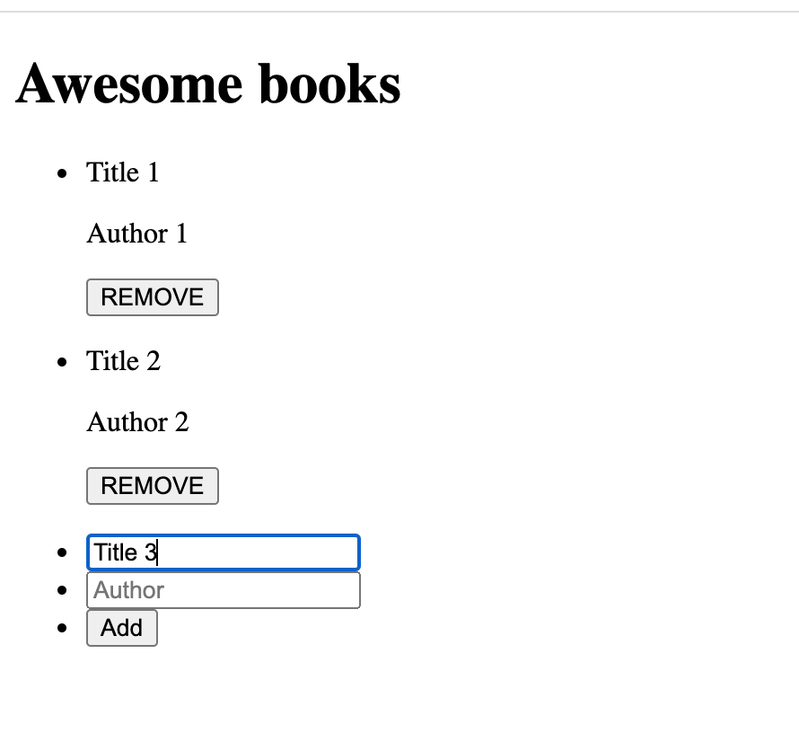

# Awesome-books

The project looks like this

## Built With

- HTML
- CSS
- JavaScript

## Getting Started

**Download/clone the repository. Open index.html file in Google Chrome browser. Open DevTools and use Toggle device toolbar to show how the site looks on a smartphone.**

#### To get a local copy up and running follow these simple example steps.

- Click the green `Code` button on the repo and copy link
- In your local PC, open your terminal in the folder you would like to clone the project.
- Clone the repo with the command: `git clone (copied link)`; like so: `git clone https://github.com/MeqdamAlqudah/Awesome-books/`
- On the terminal, navigate into the directory like so: `cd Awesome-books`

## Authors

👤 **Meqdam Al-qudah**

- [GitHub](https://github.com/MeqdamAlqudah)
- [Twitter](https://twitter.com/MeqdamQudah)
- [LinkedIn](www.linkedin.com/in/meqdam-al-qudah-7514a21b5)

👤 **Bohdan Shcherbak**

- [GitHub](https://github.com/akucintavalent)
- [Twitter](https://twitter.com/ibodi828)
- [LinkedIn](https://www.linkedin.com/in/bohdan-shcherbak/)

## 🤝 Contributing

Contributions, issues, and feature requests are welcome!

Feel free to check the issues page.

## Show your support

Give a ⭐️ if you like this project!

## 📝 License

This project is [MIT](./MIT.md) licensed.
